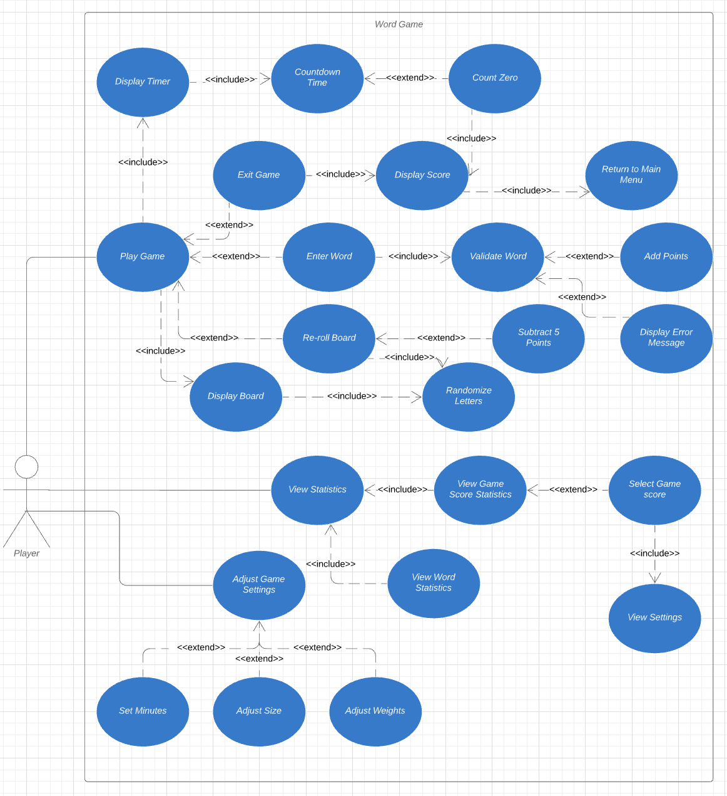

# User Journey

**Author**: Team112
**Version**: 1.0
**Date**: Feb 28 2020

## 1 User Journey Diagram

## 2 User Stories

1. Adjust Game Settings
    - *Requirements:* This use case must allow the player to be able to adjust the game settings which include adjusting the minutes of the game, the size of the board, and the weights of each letter. 
    - *Pre-conditions:* Player must select Settings from main menu. 
    - *Post-conditions:* Once the use case is run all settings must be applied. 
    - *Scenarios:*
        - Player updates total minutes of the game
        - Player updates the size of the board
        - Player updates weights of letters

2. View Statistics
    - *Requirements:* This use case must allow the player to either view the game score statistics or the word statistics. 
    - *Pre-conditions:* Player must select View Statistics from main menu. 
    - *Post-conditions:* Once the use case is run the player was able to view game score and word statistics. 
    - *Scenarios:* 
        - Player views game score statistics.
            - List of final game scores display.
            - List of number of times the board was reset displays.
            - List of the number of words entered in the game displays.
            - User selects game score from the list and views the settings for that game's board size, number of minutes, and the highest scoring word played in the game. 
        - Player views word statistics.
            - List of words displays.  
            - Number of times words have been used displays. 
   
3. Play Game 
    - *Requirements:* This use case must allow the Player to play the word game by entering words relative to the letters displayed on the board. 
    - *Pre-conditions:* Player must select Play Game from main menu. 
    - *Post-conditions:* Once the use case is run the player has played the game and the score will be displayed. 
    - *Scenarios:* 
        - If player enters word
            -  word must be validated 
            -  if word is valid, add points to score 
            -  if word is invalid, no points added to score and error message displayed 
        - If player re-rolls board, the letters become randomized and 5 points are subtracted from the score
        - If player exits game or time runs out
            - Score is displayed
            - Player is returned back to main menu 

        
