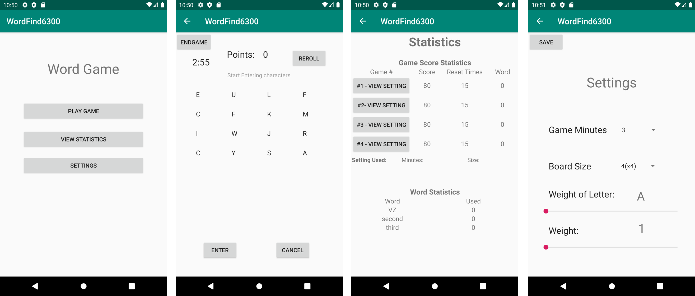

# USER MANUAL

Author: Team112 Version: 2.0 Date: Mar 5 2020

**Topics:**

* [Overview](#overview)
* [Play Game](#play-game)
    + [Board](#board)
    + [Scoring](#scoring)
* [Game Settings](#game-settings)
    + [Weight](#weight)
    + [Game Length](#game-length)
    + [Board Size](#board-size)
* [Game Statistics](#game-statistics)
    + [Word Statistics](#word-statistics)
    + [Game Statistics](#game-statistics)

## Overview
The WordGame application is a word game that players can score by entering words using letters from a randomized board. 
Below are the four interfaces. Main UI, Play Game UI, Statistics UI, and Settings UI.
 
 
## Play Game
### Board
The WordGame application is a game that users can enter words using letters from a randomized board and score. Once a player pushes the Play Game button, a board will display with randomly generated letters. The timer will start immediately. Player has to start tapping letters and enter words to score. The board is generated with consonant and vowel constraints.  

### Scoring
Each valid word that is entered by the user will count as 1 point/letter. A valid word has to include at least two letters that are horizontally, vertically, or diagnolly adjacent. Word can only include letters. User may wish to reroll the board at a cost of 5 points. 

## Game Settings
### Weight
Weight is a value ranging from 1 to 5 that is assigned to each letters. The weight determines the probability of the letter being generated on the board. 

### Game Length
Game length the game length is from 1 minute to 5 minutes. The default is 3 minutes.

### Board Size
The board size can be from 4x4 to 8x8. The default is 4x4. 

## Game Statistics
### Word Statistics
Word statistics shows a list of words that the player entered and the number of times entered.

### Game Statistics
Game statistics displays points, number of times reroll, and game numbers. 
Each game number has a link so that users can view the game settings. 

